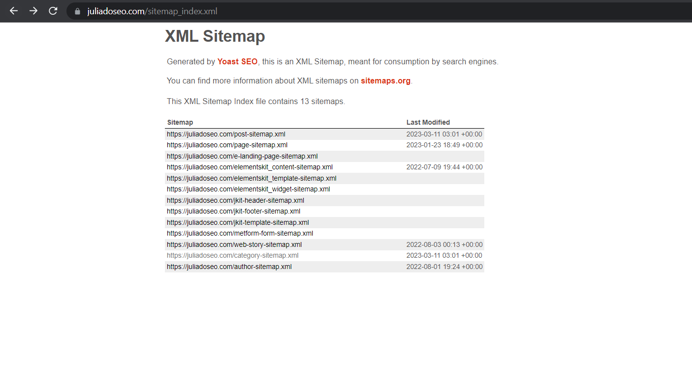

# O que é um `sitemap`?

Vamos abordar agora como o Google consegue ter "total" conhecimento das páginas de seu site, vamos falar do `sitemap`.

O `sitemap`, como o nome mesmo já diz, é um mapa do seu site que você consegue criar para auxiliar o Google a navegar pelo seu site e o entender.

O `sitemap` lista quais são todas as suas URLs criando uma estrutura para seu site, então o Google entende através do seu `sitemap` que você tem uma página principal (Home), as páginas de categorias e as páginas de subcategorias, por exemplo. Se for um blog, seria a página principal do blog que lista todas as publicações e os posts sendo pedaços menores dessa listagem, cada post tendo uma página separada e indexada, sendo referênciada como um post no `sitemap`.

## Como é um `sitemap`?

O `sitemap` é um arquivo XML de dados estruturados para mapear as páginas por meio de suas URLs, ou seja, se pareceça com algo como:

E ou acessar o índice desses `sitemaps` pelo navegador, em um site construído com WordPress e o plugin Yoast, temos algo como:

O que podemos notar nas imagens é que:

- Temos a URL da página;
- Temos um `sitemap` para cada "área" do nosso site;
- Temos tags que informam ao buscador a prioridade, o tipo de página e a frequência com que é alterada;
- E que preferencialmente colocamos a data de ultima modificação.

Mas por quê colocar a data de modificação? A colocamos pois quando fazemos uma alteração no `sitemap` queremos que o Google saiba disso na próxima vez que encontrar nosso site ele deve atualizar os dados que guardou sobre nosso site.

> **É importante ressaltar que cada `sitemap` comporta até 50 mil URLs, ou melhor dizendo, 50mb de memória.**
>
> Site para aprender a criar e entender melhor `sitemaps` é:  > https://sitemaps.org/

Podemos definir a escala de prioridade entre as páginas, como citado anteriormente, onde 1 é a prioridade maior, 0.9 é a segunda, 0.8 a terceira e assim por diante.

Quando utilizamos ferramentas (frameworks, geralmente), não precisamos de fato criar nossos `sitemaps`, pois as próprias ferramentas, como o WordPress, já os geram para nós. Mas caso estejamos criando um site do zero, sem o uso dessas ferramentas, precisamos criar o `sitemap` nós mesmos.
