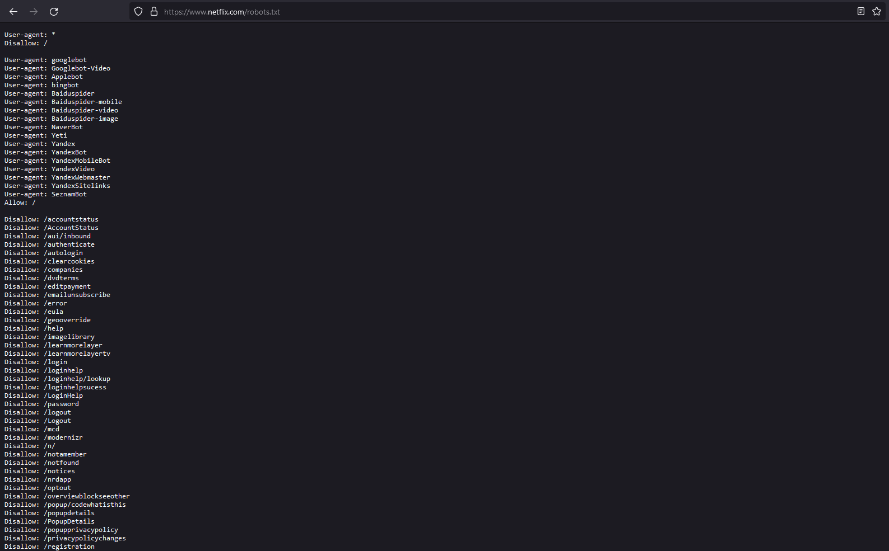

# O que é o `robots.txt`?

Assim como nos `sitemaps` falamos pro Google todas as URLs que temos dentro do nosso site, temos de ter uma forma de limitar a visualização do Google e é aí que `robots.txt` entra.

Já vimos as tags `noindex` e `nofollow` que limitam como o Google vai indexar ou seguir os links de uma determinada página, mas isso não o impede de acessar, catalogar e avaliar essas páginas.

Com o `robots.txt` informamos ao Google quais são as páginas que são ou não páginas para serem acessadas pelo GoogleBot, pelo Crawler.

## Um exemplo:

Um ótimo exemplo seria o arquivo `robots.txt` da Netflix.

A estrutura desse `robots.txt` tem o `User-agent`, que cita cada um dos bots dos buscadores que temos. Estamos falando quais são os agentes que podem acessar determinadas partes do nosso site.

No inicio da declaração do arquivo, o `User-agent` recebe como valor um "\*", que informa que todos os bots não devem acessar e gastar o tempo dele com a página raiz do site.

Em seguida, ele informa que somente esses agentes específicos (visto a enorme quantidade de bots diferentes, um abaixo do outro declarados como valores do `User-agent`) podem acessar a página raiz do site. Ou seja, ele diz que qualquer um não deve acessar, à menos que sejam os bots especifícados.

> Podemos notar que o `Disallow` é o que dita quando não é permitido a análise e exploração do bot e o `Allow` é o que permite essa análise e exploração dos bots.

Mas, ainda que esses `User-agents` listados possam acessar essa página e algumas outras mais listadas no documento, eles ainda vão enfrentar uma longa lista de diretivas `Disallow` para diversas páginas específicas do site.

Para ficar mais claro ainda, quando buscamos utilizando uma Search Engine que tem o bot permitido à indexar essa página nas SERPs (na página de resultados de uma busca) e escrevemos: "Entrar na Netflix", teremos no resultado a página de login indexada e com fácil acesso para o usuário, mas a página de logout (como podemos ver na imagem ou acessando o site do `robots.txt` da Netflix) não faria sentido ser indexada, pois para sair dela é necessário que já se esteja no site. Então, além de um `noindex` nas meta tags do HTML da página, teriamos também a otimização do `robots.txt` que informa que o bot não deveria nem gastar tempo analisando a página.

Uma busca pela página de logout retornar a página na SERP é contraintuitivo e contraprodutivo, uma vez que as páginas que realmente interessam numa busca pelos serviços e páginas da Netflix precisam de algo que sane o problema do usuário e não o confunda ainda mais, ou que até mesmo faça uma ação que leve à uma mensagem de erro (já que o usuário nem no site estava, muito menos estaria logado para efetuar a ação deslogar). Em suma, a página de logout não é relevante para os usuários, não traz nada de útil para o usuário numa busca no Google.

> Não significa que o Google não possa indexar essa página, significa que informamos ao Google que essa página não é relevante, por isso colocamos a diretiva `Disallow`.

## Tags/Diretivas do `robots.txt`

- User-agent: o bot em si, quais são os bots permitidos e não permitidos de acessar e analisar a página;
- Allow: que permite o acesso e análise automatica após o passeio do Crawler pelo conteúdo da página;
- Dissalow: que faz o contrário da tag Allow e;
- Sitemap: uma linkagem para o `sitemap.xml` do seu site, algo que a própria Netflix não faz, mas que não muda como é importante o fazer em nossos sites.

> A partir do momento que o Google encontra seu `robots.txt` ele também acha seu `sitemap.xml`, e vice-versa. Eles são **complementares**.

## `Disallow` x `noindex`

A pergunta que provavelmente pode surgir.

Explicando novamente, o tag `noindex` não impede que o Google **leia** seu site, ela basicamente impede que o Google **indexe** seu site, ela serve de fato para garantir a não indexação de uma página no Google.

Já o `Disallow` que é usado no `robots.txt` tem como objetivo otimizar o budget do bot do Google, fazendo-o gastar menos tempo com páginas menos relevantes para seu negócio, deixando o foco nas páginas que são de fato importantes para nós. Afinal, não queremos que os bots gastem tempo encontrando essa página.
