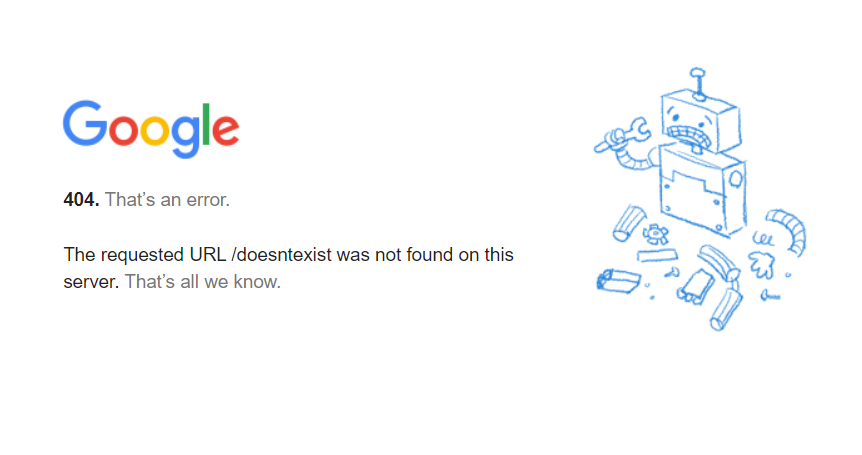

# Para que servem os redirects?

Você provavelmente já se deparou com uma página de erro ao navegar pelos sites da web. Algo como:

E também, talvez, você tenha se perguntado do que se trata esse erro 404 e por que ele acontece.

Esse erro 404 acontece quando uma página não existe na internet, e se ela não existe ou se em algum momento já existiu, existe uma solução que podemos implementar para que essa página não caia num erro 404.

## A solução

Existe um conceito chamado `redirect` que redireciona você de uma página para outra (pelo nome já percebemos que é bem intuito sua funcionalidade).

Ele é dividido entre _redirect 301_ e _redirect 302_, vamos entender do que se trata cada um deles.

**Redirect 301:**

Esse tipo de redirecionamento é caracterizado por dois aspectos:

- Redirecionamento permanente;
- Trasferência de autoridade.

Algo como:

**https://seusite.com/url-antiga --301--> https://seusite.com/url-nova**

Esse redirecionamento permanente da página é quando queremos transferir toda a Autoridade previamente construída na URL antiga para a nova, como é feito no exemplo acima.

**Redirect 302:**

Também caracterizado por dois aspectos fundamentais:

- Redirecionamento temporário;
- Sem transferência de autoridade.

Algo como:

**https://seusite.com/pagina-em-atualizacao --302--> https://seusite.com/url-substituta-temporaria**

Quando falamos do redirect 302 estamos lidando com algo temporário, para fins de manutenção na página daquela URL ou algum outro motivo que faça sentido o uso do redirect dessa forma.

É importante salientar que essa transferência de autoridade não vai ocorrer, exemplificando: todos os links contruídos, reputação da página, tráfego, confiança, expertise e autoridade conquistada para aquela URL não serão transferidos para a nova, diferentemente do redirect 301, afinal não faria sentido perder a relevância construída.

### Casos de uso:

**Redirect 301** é usado para:

- Páginas que são substituidas:
  - A substituição de uma página em uma URL para outra.
- Páginas que são excluídas (com tráfego e backlinks):
  - Se vamos excluir uma página de nosso site que possui um conteúdo e autoridade relevante, seria bom redirecionar o usuário para outra página.
- Alteração de domínio:
  - Quando se altera o nome do site:
- Migração de HTTP para HTTPS:
  - É necessário redirecionar permanentemente os acessos HTTP para páginas HTTPS.
- URLs com www:
  - Quando tiramos ou adicionamos o www na url é necessário o redirecionamento permanente.
- URLs com /:
  - Mesmo caso do www.

**Redirect 302** é usado para:

- Páginas que precisam de um foco temporário (como campanhas ou promoções específicas);
  - Na campanha de Black Friday, em vez de levar os usuário para a categoria de celulares do meu site, as redirecionarei para a landing page para venda de celulares da Black Friday.
- Páginas que estão passando por manutenção.

> Existem muitos outros tipos de redirecionamentos e para termos uma visão definitiva dessa questão podemos acessar o conteúdo do Semrush sobre o tema: https://pt.semrush.com/blog/redirecionamentos/ Também temos um diagrama dessa mesma publicação do Semrush, sobre quando utilizar os redirecionamentos, esse diagrama estará disponível abaixo.

### Quando fazer um redirect?

Iremos apresentar agora um diagrama sobre quando utilizar redirecionamentos.

Seguindo esse fluxo de pensamento e implementação dos redirecionamentos, podemos ter soluções concisas para nossos problemas.

Mas, o que pode acontecer de errado ao se utilizar os redirects de forma indevida?

### Redirect Chain

Traduzindo o termo para português temos algo como Cadeia de Redirecionamento, que é quando uma URL passa por vários redirects até chegar na URL final.

Isso excede o budget do Crawler, do bot que vasculha e analisa nossos sites, e acaba por nos trazer penalidades quanto ao ranqueamento do nosso negócio nos motores de busca. E, além disso, também traz uma demora maior no carregamento da página, o que afeta as noções de performance passada para os bots e também afetam dastricamente o ranqueamento do nosso site.

> Uma ferramenta para podermos lidar com isso, com a questão dos redirecionamentos excessivos, é o [Redirect Path](https://chrome.google.com/webstore/detail/redirect-path/aomidfkchockcldhbkggjokdkkebmdll).
