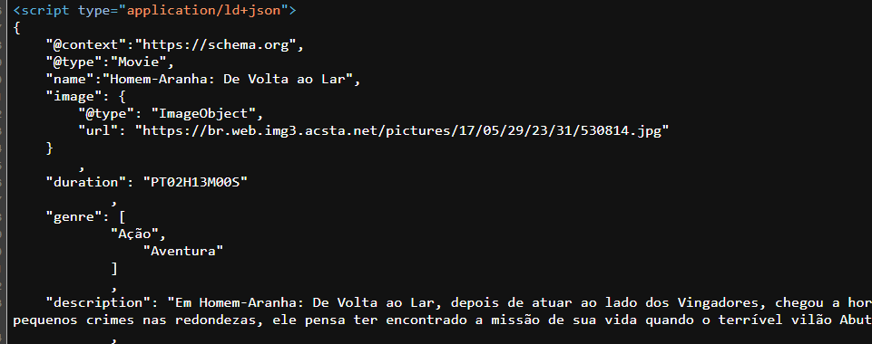
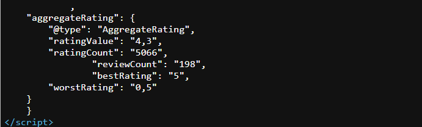

# Schema

Quando falamos de Schema estamos falando de Dados Estruturados.

Em SEO, os dados estruturados são marcações no código HTML da página que ajudam os mecanismos de busca, como o Google, a interpretar os conteúdos que temos em nossas páginas dos nossos sites.

O Schema é um tipo de dado estruturado que serve para contextualizar para os buscadores a função dos elementos de um página no nosso site. Dessa forma, os bots conseguem entender com clareza qual é o objetivo de cada uma dessas páginas e, através dos Schemas, o Google consegue mostrar o que chamamos de Rich Snippets.

## Rich Snippets

Como o próprio nome sugere, os Rich Snippets, são complementos "ricos", ou seja, com conteúdos extras, que advem de dentro das páginas que tem o Schema implementado numa SERP, num resultado de pesquisa do Google.

Como, por exemplo: páginas de produtos que utilizam as avaliações e preços de forma correta e podem aparecer num resultado do busca no Google ou até uma página de receitas que, ao implementar corretamente seus elementos e Squema, podem fazer aparecer nas buscas partes de seu conteúdo, complementos "ricos" junto da URL que leva à pagina, páginas de eventos, entre outras...

### Na prática

Não é necessário saber codar nada, não é necessário ter conhecimento de programação, só precisamos saber o caminho que deve ser seguido para implementar os Rich Snippets, podendo usar templates do [schema.org](https://schema.org/docs/gs.html) para se guiar e usufruir dessa tecnologia, e validar isso depois com uma ferramenta como o [Teste de Pesquisa Aprimorada](https://search.google.com/test/rich-results) do Google.

De forma objetiva, observe as imagens e conclua como a complexidade da implementação é reduzida é um simples script JS na página:

Aqui, temos o início do dado estruturado de Schema da página:

No final desse script no código fonte da página escolhida, temos o fator de Rich Snippet sendo implementado:

E aqui temos o resultado dessa implementação:

Mas o que isso implica? Na qualidade da experiência do usuário e na visão do mesmo sobre nosso conteúdo, que possivelmente, em comparação com outros, pode gerar maior noção de confiança, qualidade, legitimidade, expertise, AUTORIDADE e, com isso, levar à um clique e futuramente uma possível conversão (uma venda ou assinatura).

Qual resultado você clicaria? A questão é sempre essa, atrair o usuário e transforma-lo em cliente.

Por meio da estruturação do Schema podemos então, além de criar uma melhor estruturação do nosso site, do propósito de cada página e a percepção dos buscadores ante nosso conteúdo, criar a possibilidade de aparecer nas buscas com maior qualidade, destaque e autoridade no assunto, gerando mais cliques e eventualmente converções. Lembrando sempre que a validação desses dados pode sempre ser feita com uma ferramenta como a citada no ínicio dessa sessão de anotação.
