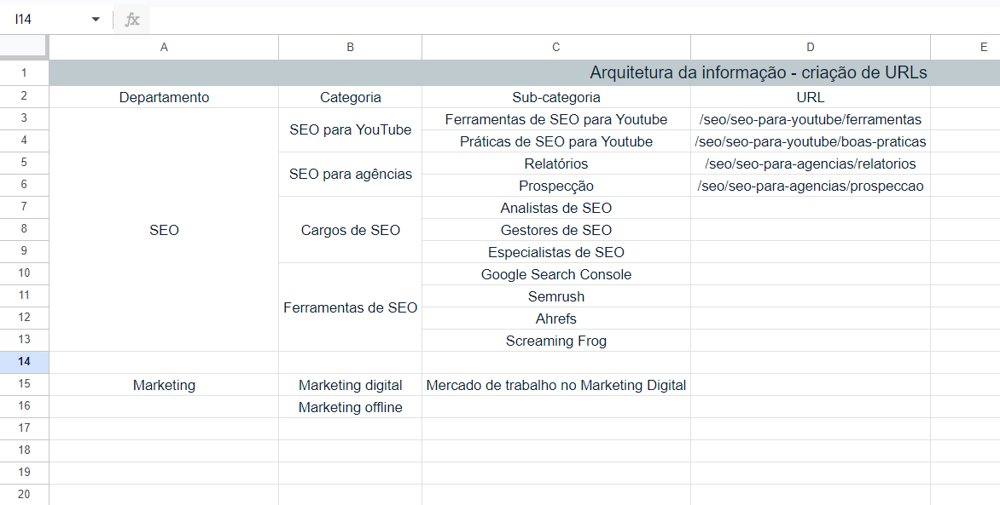

# Estrutura do Site: Categorias, Níveis Hierárquicos e URLs

No começo dos nossos estudos estamos falando sobre o Google e o quanto é importante a **estrutura** de um site, então, todo o nível hierárquico que definimos desde as categorias até as páginas de produtos em si, são muito importantes na hora dos buscadores entederem do que se trata o seu site.

Então, vamos nos aprofundar nisso.

## 4 motivos para criar uma estrutura de site pensada em SEO

Por quê criariamos um site pensado dessa forma?

**1**: o primeiro motivo é que a navegação e experiência dos usuários é de extrema importância para seu site. É importante que, assim como os buscadores, os usuários entendam onde estão na página e se localize através da sua estrutura, entendendo o funcionamento do seu site de maneira orgânica, como um serviço que é prestado, como algo realmente útil e que agrega à vida dele algum valor.

**2**: o segundo motivo é a ramificação por níveis, mas como assim? Quanto temos uma estrutura definida e seus níveis de acesso, que seriam as partes por quais os usuários vão adentrando seu site e consumindo seu conteúdo, facilitamos também que os crawlers identifiquem e passeiem pelo seu site indexando e ranqueando as páginas de uma forma melhor. Isso se dá pois entende-se o nível de importância de cada página e quais delas tem maior prioridade para serem achadas numa busca do que outras dentro do seu próprio site e de outros por consequência, pois uma estrutura melhor acarreta numa qualidade melhor, e maior qualidade leva ao cerne do que o Google procura, algo que resolva o problema dos usuários e que traga real valor como resultado de uma busca. Por exemplo, em um e-commerce os departamentos são mais importantes que categorias, subcategorias menos importantes que categorias e que são mais importantes que os produtos em si, pois estão todos contidos um dentro do outro de uma forma hierárquica, por níveis.

**3**: o terceiro motivo é a linkagem interna. Quando temos a estrutura de nosso site bem definido, com um bom menu, por exemplo, conseguimos fazer uma linkagem interna que consiga prover aos crawlers um passeio suave entre as páginas de seu site.

**4**: E o ultimo que vamos enumerar se trata da facilitação de rastreamento. Quando organizamos toda nossa estrutura, facilitamos o processo dos crawlers de ir passeando, interpretando, indexando e ranqueando cada uma das nossas páginas, garantindo que todas as URLs (páginas) tenham sido vistas e propriamente analisadas e catalogadas.

Mas como isso funciona na prática?

## Figma ou outras ferramenta de criação e estruturação

Ao utilizarmos essas ferramenta podemos criar a estrutura e planejar melhor como faremos a implementação de nossos sites com uma finalidade mais bem definida, mirando os principais conceitos, serviços e produtos do negócio escolhido ou da empresa em si.

Um exemplo simplista (um esboço) de um site de Marketing Digital feito pelo Figma seria algo como:

Sendo cada uma das divisões colocadas (SEO, PPC, etc.) os departamentos, os temas, que abordamos no nosso site.

E podemos criar exemplos mais diretos, menos visuais, mas ainda entendíveis e bem organizados numa planilha do programa Excel da Microsoft:

Dessa vez especificando não somente o departamento, o tema, mas as subcategorias desses temas e sua URL resultante.

> Lembrando que ao criar URLs nós nunca usamos caracteres especiais, acentuação, cedilhas e sempre que formos separar palavras utilizamos o hífen (`-`).

A estruturação dos dados sintetizados acima estão no escopo de planejamento, de idealização da implementação que será ainda feita. Nós podemos, da mesma forma que foi feita essa imagem de estruturação pelo Excel, descobrir as palavras-chave mais relevantes dentro de um nicho (de um departamento, de uma categoria) e criar conteúdos, URLs e até subcategorias que usufruam do poder de busca já atribuído à essas palavras-chave, e podemos fazer isso por meio de alguma ferramenta como o [Semrush](https://www.semrush.com/), com a ferramenta Keyword Magic.

Dessa forma pudemos pegar uma das buscas mais comuns, que era Youtube SEO, e transformamos numa categoria, que conseguentemente, por meio de mais pesquisas, nos mostraram que poderia ser dividida mais duas vezes, entre Ferramentas de SEO para Youtube e Práticas de SEO para Youtube.

E não precisamos todas as vezes que quisermos criar uma publicação ter de criar uma subcategoria ou algo do gênero para poder publicar, podemos colocar essas publicações e páginas dentro das próprias categorias e deixar assuntos mais específicos e que precisam ser agrupados mais separadamento dentro da categoria em uma subcategoria.

Podemos entender então que a estruturação do nosso site, além de nos prover uma organização hierárquica de fácil navegação para buscadores e usuários, já ataca os departamentos, categorias e temas, subcategorias e até URLs com as palavras-chave necessárias para termos ainda mais autoridade nos resultados da busca, além de trazer melhor manutenibilidade e qualidade em geral para diversos outros aspectos.

E claro, vale lembrar que essa estrutura proposta se trata de um blog e mais pra frente veremos melhor a categorização de sites de produtos.

> É essencial notar que as boas práticas de SEO estão sendo aplicadas nessa estruturação e o exemplo mais claro disso fica nas URLs, pois pode-se reparar que nenhuma delas tem o Spam de Keywords, como por exemplo na primeira URL criada, que por já incluir `seo` e `seo-para-youtube`, não incluiu mais uma vez as palavras chave em `ferramentas`, pois já estamos falando e utilizando essas palavras de forma mais que suficiente (colocar algo como `ferramentas-para-seo-no-youtube` seria redundante e provavelmente penalizado pelos mecanismos de buscas).
