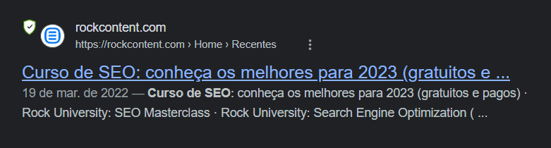
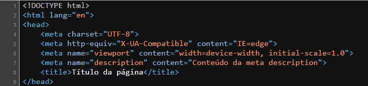

# Title Tag e Meta Description

Essas duas implementações que fazemos em todas as nossas páginas, `title tag` e `meta description`, são marcações no header do HTML com objetivo de passar aos buscadores como o Google, um título e pequena descrição do seu site, se trata justamente do que aparece nas buscas quando procuramos por um tema específico. Um exemplo:



O que aparece primeiro e em azul é a `title tag`, que é o título da página, o "nome" dela (do que ela se trata) e a `meta description` é o pequeno texto que aparece abaixo do título, que contextualiza em breves palavras o conteúdo daquela página. A `title tag` é um dos fatores de ranqueamento nos mecanismos de buscas e é um ótimo espaço para conseguirmos trabalhar algumas palavras chave.

A `meta description`, por outro lado, é responsável por melhorar o seu CTR (Click Through Rate), que é a proporção de cliques em um link específico em relação ao número total de usuários que visualizam uma página, e-mail ou anúncio.

Vamos falar mais sobre CTR no módulo de KPIs e iremos entender um pouco melhor essa métrica, mas já devemos saber que a `meta description` é totalmente relevante no contexto de qualquer página.

## Expandindo o entendimento das tags

Apesar desses dois elementos do HTML serem muito importantes e termos de criá-las, nem sempre os mecanismos de buscas vão usar ambas. Isso por quê os mecanismos de buscas tentam usar trechos do seu conteúdo que façam sentido para a busca do usuário; então se suas tags estão falando do assunto principal do conteúdo e os usuários buscarem sobre algum tópico específico que está contido no seu texto, ele pode usar algum trecho daquele tópico na SERP, mas isso não tira a relevância da implementação de ambas.

Normalmente, essas tags também podem aparecer nas plataformas de criação de sites como WordPress, como título SEO e descrição SEO, pois elas são feitas para ajudar no SEO das suas páginas.

É possível notar também que, além da `title tag` e `meta description`, na própria URL do site temos o `breadcrumb`, que mostram a estrutura do seu site, que informam a categoria que aquela página pertence. No exemplo dado na introdução podemos ver que a URL é apresentada duas vezes, primeiro somente com o nome do domínio e abaixo disso, o domínio e a estrutura de categorias de páginas:


### Como localizar as tags title e description no código fonte?

Abaixo está um exemplo de como elas aparecerão no código fonte das páginas:

```html
<title>Título da página</title>

<meta name="description" content="Conteúdo da meta description" />
```

E para fins de visualização, aqui está uma imagem de ambas num código fonte:



## Regras para criação das tags

O `title tag` deve conter, no máximo, entre 40 e 60 caracteres e a palavra-chave sempre mais para a esquerda. Assim não deixamos o título de nossa página nem tão curto, nem tão longo e acabe por não aparecer apropriadamente nas buscas (com reticências quando exceder o limite, principalmente para dispositivos Mobile, por terem o espaço reduzido) e para garantirmos que a busca feita pelo usuário tenha como resultado uma SERP que apareça nossa página e seja vista de imediato a palavra-chave principal da sua busca, melhorando a taxa de CTR.

> Uma boa `title tag` segue um padrão, se possível: `Título Página Separador Título do site`, como apontado e feito automaticamente pelo Yoast (um plugin para sites WordPress). Mas é sempre bom reescrever essa tag para se adequar ao nosso estudo de caso para cada post, para atendermos à demanda dos usuários por aquele tema em suas buscas.

Sobre a `meta description`, precisamos garantir que ela tenha entre 140 e 160 caracteres, pelos mesmos motivos de visualização, qualidade e percepção por parte dos mecanismso de buscas que a `title tag`. É sempre indicado, talvez necessário, incluir o CTA (Call To Action), uma chamada para ação de clicar no link, fazer o usuário se sentir compelido à acessar o site, palavras como "confira", "acesse", "saiba mais", etc, são bons exemplos de chamadas para ação. E também é muito importante que coloquemos a palavra-chave principal na primeira frase, o mais a esquerda possível, não necessáriamente na primeira palavra, como é indicado no título, mas _o mais a esquerda possível sempre_.
