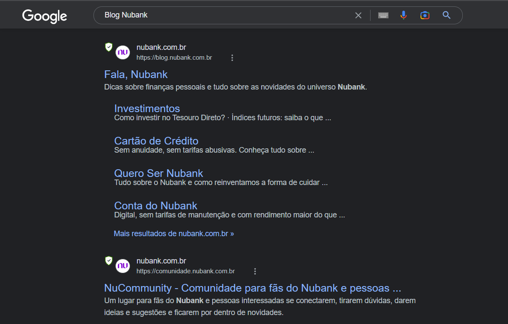
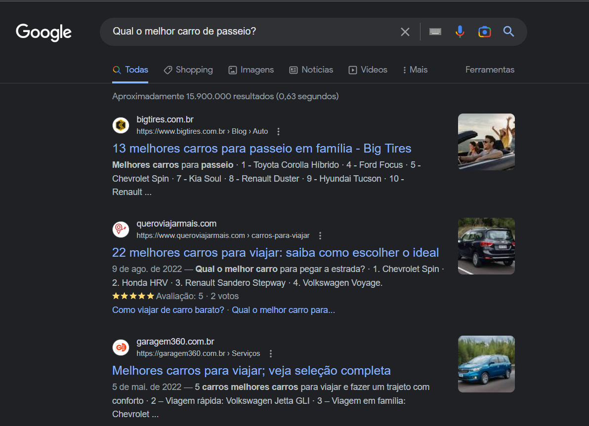
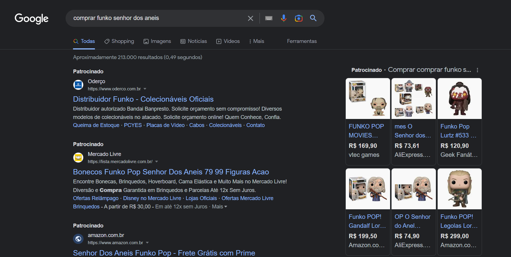

# Intenção e Micromomentos de busca no Google

Vamos abordar agora um dos temas mais importantes de SEO no pilar de conteúdo, principalmente nos dias de hoje: a intenção de busca, ou "Search Intent".

## Search Intent: por que é tão importante?

Quando paramos para analisar os conceitos e aplicação de métodos de identificar e utilizar dos insights advindos por Search Intent dos seus usuários, não estamos mais nos preocupando só com as palavras-chave em si, mas com a busca que o usuário está fazendo e o que ele espera encontrar com essa busca.

Então, o Search Intent tem como objetivo entender exatamente o que o usuário busca, como busca e o que ele espera receber, é a interpretação do que o usuário espera da busca que realiza.

## Tipos de intenção de busca

Temos três tipos de intenção de busca que são muito relevantes:

- Navegacional;
- Informacional e;
- Transacional.

E nós vamos entender cada uma delas.

### Navegacional

É quando o usuário utiliza o Google como um meio de achar um site que já quer acessar, um site/página já conhecido e do seu interesse. É a utilização dos mecanismos de busca por parte dos usuários para simplesmente encontrar o que já deseja, a possibilidade de descoberta e interesse em acessar outras páginas é bem pequeno nesse tipo de intenção de busca, uma vez que já está previamente definido o que se espera como resultado pelo usuário, ele sabe o que quer e irá pesquisar de acordo com essa percepção e entendimento.

É como se quisessemos pesquisar por "Blog Nubank"; já sabemos o que desejamos encontrar, já sabemos o site que queremos acessar, já sabemos as redes sociais que provavelmente essa marca estará presente, então pesquisamos e esperamos encontrar algo assim:

O usuário já está direcionado e determinado a encontrar uma marca/site/página específica e só está usando o Google como uma forma de encontrar isso mais rapidamente.

### Informacional

Na intenção de busca Informacional é quando buscamos informações acerca de um tema, uma ou um conjunto de informações específicas sobre algo.

Aprender ou tirar alguma dúvida sobre qualquer coisa é algo mais do que comum nas buscas do Google, algo que provavelmente fazemos todos os dias ou com certa frequência. Por exemplo:

A intenção dessa busca é completamente diferente da Navegacional, uma vez que o objetivo, o que é esperado como resultado e o como o usuário se comportará são diametralmente opostos, tendo a única caraterística comum sendo o interesse em acessar um site/página. A busca Navegacional feita nos retorna uma Home de um site que estamos pesquisando, a busca Informacional nos traz diversas respostas para uma pergunta em vários sites e artigos diferentes que possam nos trazer o conhecimento e informação que desejamos.

### Transacional

Por ultimo, temos a intenção de busca Transacional, que é quando o usuário realiza uma busca com intuito de comprar algo. Por exemplo:

Quando a intenção de busca é transacional, busca-se por um produto/serviço específico com a intenção de realizar a transação, a compra.

## Como usar a intenção de busca na hora de preparar conteúdos?

Que é importante termos em mente qual é a intenção de busca de um usuário para criar e apresentar um conteúdo que faça sentido para as buscas específicas dos usuários.

E isso fica claro ao pesquisarmos por "computador", "formatar computador" e "computador dell", que respectivamente nos levam à pesquisas com intenção de busca Transacional, Informacional e Navegacional/Transacional.

### Mais especificamente, como?

O Google separou os usuários em 4 micromomentos na hora de realizarem suas buscas:

- Eu quero **saber**;
- Eu quero **ir**;
- Eu quero **fazer** e;
- Eu quero **comprar**.

O Google diz que 99% das buscas estão enquadrados em um desses momentos e, então, qual o trabalho do seu site?

_Produzir conteúdos que se encaixem em cada um desses momentos, para que o usuário te encontre não somente quando quer saber ou comprar algo, pois cada um desses momentos é independente, porém podendo afetar uns aos outros se utilizarmos a estratégia certa._

O usuário que quer comprar provavelmente já quis saber, ir e fazer algo e encontrou essas soluções em outros lugares, se caso você não tenha produzido contéudo relevante e de qualidade que ataque esses momentos na intenção de busca. Logo, provavelmente a compra será feita em outro site, com outra marca que o fez entender o assunto/produto que ele desejava pesquisar sobre.

Você, como desenvolvedor, redator, analista, etc, deve influenciar as decisões de compra do usuário para transformar ele no seu cliente, aparecendo nos momentos que ele quer **saber** algo e encontra seu site, quando ele quer acessar um conteúdo específico do SEU site (ele quer **ir**) pois já o conhece e confia, quando ele quer **fazer** algo e não sabe exatamente como, mas seu site o ensina e finalmente, se ele decidir comprar um produto/serviço que seja o solução pra uma problema que ele já conseguiu encontrar no seu site, ele com certeza quer **comprar** onde ele mais sentiu-se acolhido e protegido, direcionado, por seu conteúdo.
