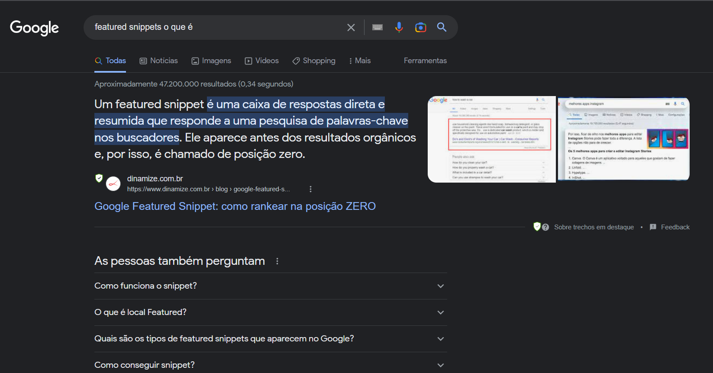
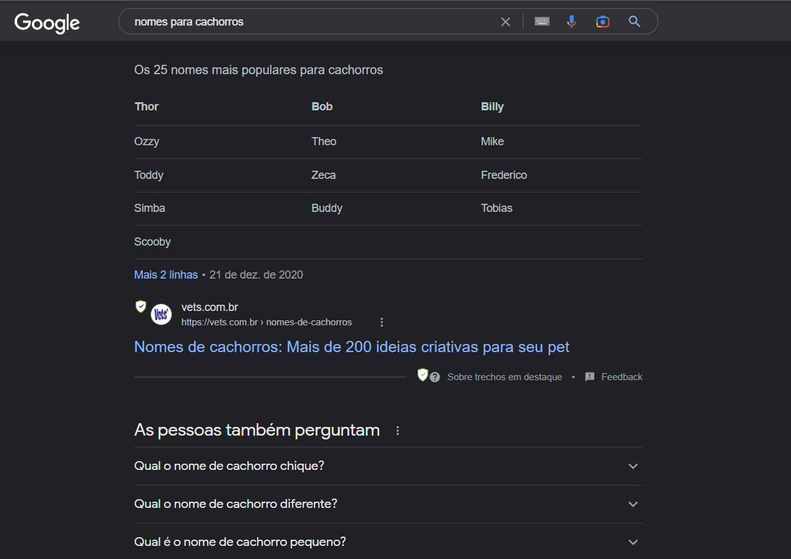
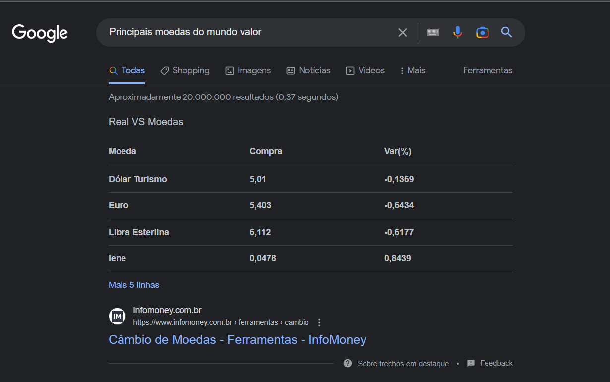

# Featured Snippets

Lembra quando você era criança e queria ser o primeiro da fila, mas sempre vinha alguém e atrapalhava dizendo: "Então eu sou o zero!", só pra poder ir na sua frente?

Inspirado na fila do recreio da escola, o Google criou o que chamamos de Featured Snippets, que são as "posições zero" do Google.

Os Featured Snippets, ou trechos em destaque, são as pré-visualizações que o Google mostra de acordo com a busca dos seus usuários com o objetivo de fazer eles encontrarem algumas respostas de maneira mais rápida e eficiente.

Hoje em dia, essa é a posição mais cobiçada pelos criadores de conteúdo em sites, já que é considerada a posição mais difícil e a que melhor responde à dúvidas dos usuários.

Ela pode aparecer de três formas:

## Como parágrafo

Quando ao buscar algo no Google como uma pergunta, é mostrado um resultado como o seguinte:

É apresentada uma resposta, como no exemplo acima que nos responde a questão "Featured Snippets, o que é?".

Se trata de uma resposta direta e sucinta para uma pesquisa de palavras-chave. Visam respondem diretamente a intenção de busca do leitor sem que ele visite alguma página. Ele já nos responde a pergunta feita na busca por meio de um parágrafo que pertence ao conteúdo de uma página que tenha Expertise, Autoridade e Confiança.

## Como lista

Por exemplo, se busco algo como "Nomes para cachorros", nossa intenção de busca é Informacional e estamos tentando entender o que é, do que se trata ou dicas/sugestões para algo, no nosso caso, nomes para cachorros.

O resultado de um Featured Snippets para uma busca como essa é:

Não é preciso acessar o conteúdo para ter acesso à essa lista, ele me traz sem que eu entre desnecessariamente em um site. Essa implementação existe para facilitar e deixar mais rápido o acesso à informação que estou buscando.

## Como tabela

Por último, temos o formato de tabela. Sendo direto, quando buscamos algo como "Principais moedas do mundo valor", já temos como resultado uma tabela estruturada que nos dispõe da informação desejada.

Seria apresentado da seguinte forma:

Pode-se notar a diferença entre a tabela e a lista nos headings da tabela, que denotam colunas, e por seus valores que correspondem ao tipo de dado inserido em cada tabela.

A ideia desses Featured Snippets é justamente responder à essas questões que os usuários fazem sem a necessidade de acesso ao site, então, seu conteúdo precisa ser objetivo e responder de forma prática as dores dos usuários. Responder as perguntas em parágrafos curtos, listas ordenadas ou desordenadas e tabelas dos mais variados tipos, faz com que consigamos mais destaque e tenhamos mais chance de chegar à tão cobiçada "posição zero".

> Cerca de 30% dos Featured Snippets vem do primeiro resultado das SERPs, ou seja, das páginas com melhor ranqueamento. Mas, os outros 70%, são dos outros resultados da primeira página, dessa forma podemos garantir que em algum momento nós podemos furar a fila e aparecer antes dos sites melhores ranqueados que nós.

## Como fazer para ganhar os Featured Snippets?

Vamos elencar aqui, na forma de lista ordenada, o que deve ser feito para tal:

1. Responda de _forma objetiva_ às perguntas definidas em H2s e H3s;
   - Temos que garantir que as perguntas serão respondidas de forma objetiva, como feito no parágrafo/lista/tabela das perguntas que fizemos nas buscas de exemplo.
2. Mantenha entre, se possível, 40 e 50 caracteres suas respostas, criando um parágrafo com essa informação sendo desenvolvida ao longo dele;
   - O parágrafo que vai aparecer nos resultados de busca possui uma quantidade de caracteres máximos, é um corte de algumas linhas. Logo, é necessário tomar cuidado com a quantidade de informações colocadas em respostas e as deixar o mais otimizadas possíveis para que seja respondida a questão do usuário com objetividade e qualidade, dando devido desenvolvimento ao longo do parágrafo que queremos que apareça como Featured Snippets.
3. Em listas e tabelas, coloque o máximo de informação na vertical, mas tome cuidado com o espaço na horizontal, para que as informações caibam no Snippet que queremos que seja gerado;
   - Pode-se notar que ao obter resultados nesses formatos temos a opção de clicar em "See More", "Mais 5 linhas", etc. Conseguintemente, podemos ter a informação de forma vertical em maior quantidade quando em relação à informações na horizontal, assim trazendo ao usuário que se interessou pelo conteúdo listado/tabelado possa ver o conteúdo completo e sanar suas dúvidas antes mesmo de acessar sua página.

### Implementar Featured Snippets pode atrapalhar o CTR?

Essa dúvida pode surgir, uma vez que nos parece uma desvantagem o usuário não clicar em nosso link e não acessar nosso site a primeira vista. Porém, a verdade é bem diferente.

Em temos de métricas, realmente os Featured Snippets acabam por tirar alguns cliques do seu site, pois quando os usuários estão procurando por uma resposta rápida, provavelmente não acessariam seu site. Mas, ao mesmo tempo, usuários que buscam esse tipo de resposta e estão com essa intenção de busca, dificilmente converteriam em alguma compra ou assinatura, caracterizando essa feature como uma percepção do Google como seu conteúdo sendo de qualidade, tendo Autoridade sobre o assunto e sendo de confiança para disponibilizar esse tipo de informação. Assim, separamos ainda mais os acessos de nossos sites e páginas de usuários que não convertem seus acessos em compras.

Melhorando de forma geral o posicionamento do seu site, os Feature Snippets trazem um ganho muito maior do que perda, visto que além de qualquer outro aspecto, o seu conteúdo é visto e mais divulgado que outros, pois é um destaque, uma referência no assunto abordado.
