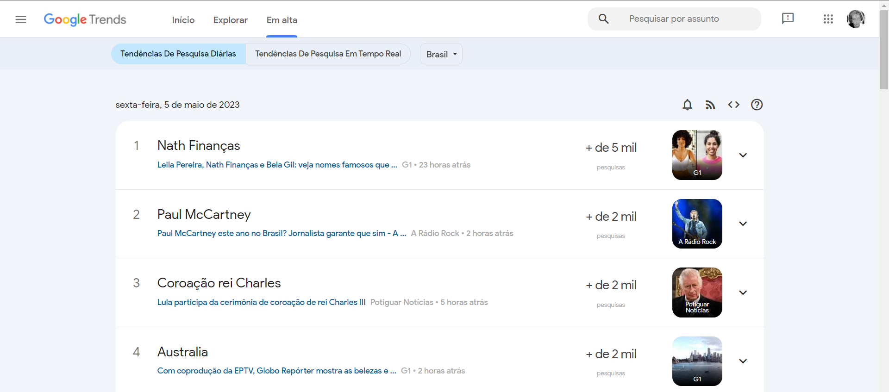
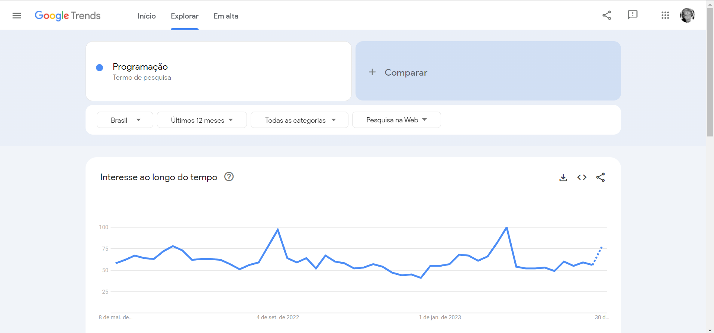
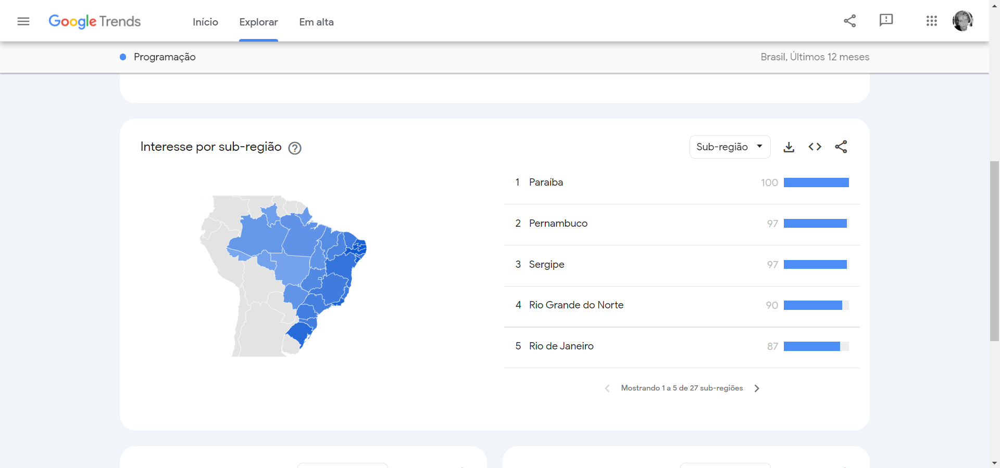
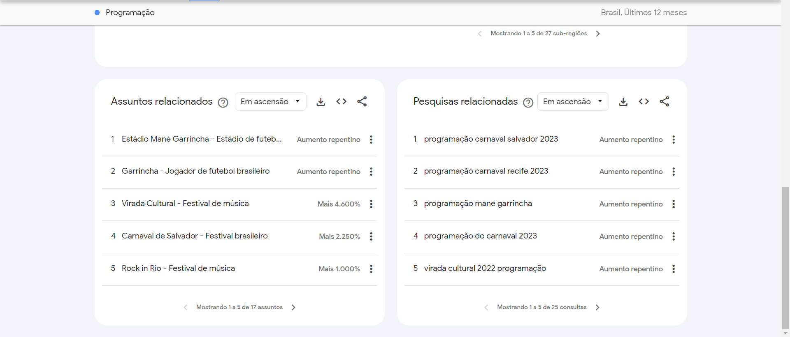
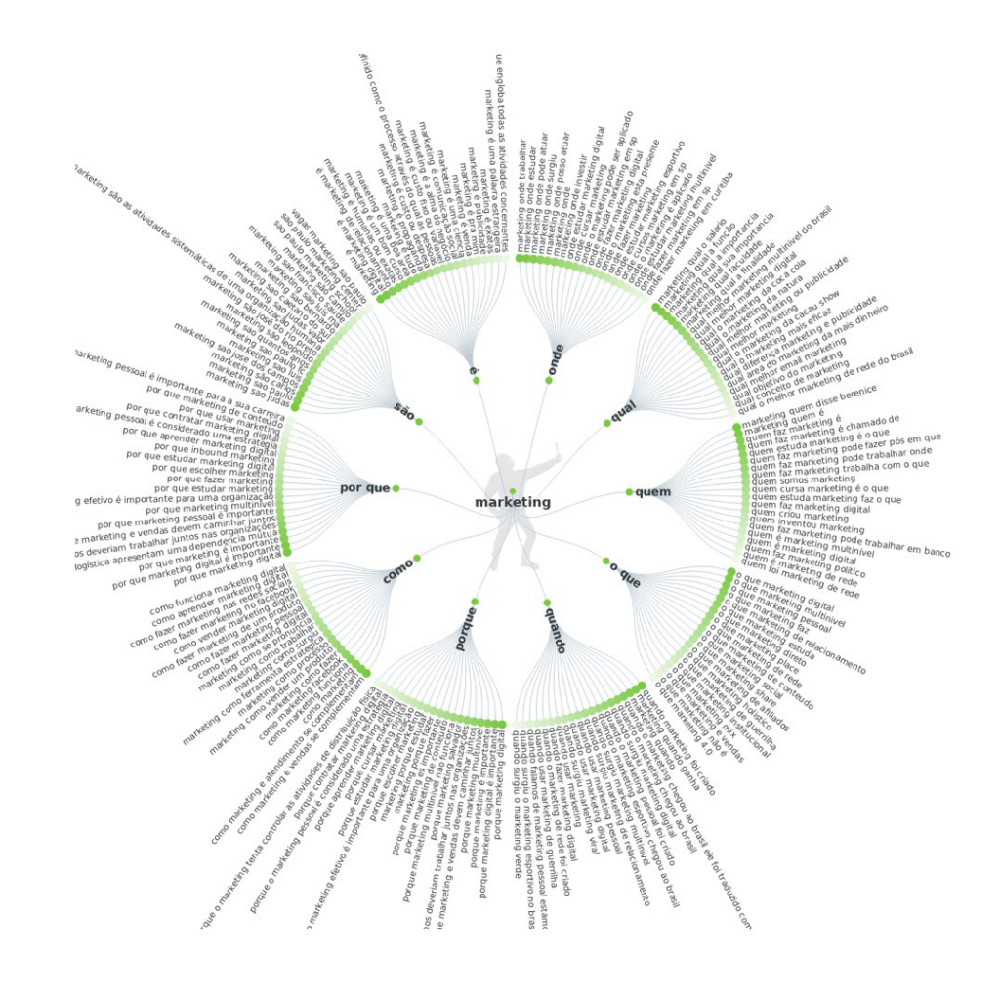

# Algumas ferramentas de pesquisa

Como já falamos no Módulo de Conteúdo (módulo 4), as palavras-chave são muito relevantes quando pensamos em estratégias de SEO. Então iremos ver agora algumas ferramentas de pesquisa de palavras-chave que podemos utilizar no dia a dia como analistas de SEO para definir nossas estratégias.

## Google Trends

Essa ferramenta é do próprio Google para entender quais são as _trends_ do mercado. O link para acesso é este:

https://trends.google.com.br/home

Conseguimos saber quais são as buscas mais feitas no Google por um usuário. Em sua página inicial já podemos visualizar o que mais está sendo buscado no Google, como por exemplo em buscas feitas diariamente, veja a imagem a seguir:

Podemos ainda personalizar os resultados apresentados determinando se queremos visualizar as buscas separadas por dia, ano, tempo real, localização, categoria e até pesquisar por assuntos específicos, algo como:

> Assunto pesquisado: "Programação".

> Resultados da palavra-chave "Programação" baseado em regiões do Brasil:

> Podemos conferir, até assuntos e pesquisas relacionadas a pesquisa de "Programação" que foram feitas por usuários:

### Para que finalidade usar essa ferramenta?

Podemos utilizar o Google Trends para entender a sazonalidade e comparar palavras-chave.

Um exemplo claro que podemos dar sobre essa ferramenta é a busca entre "Biscoito" e "Bolacha", por mais superficial que seja o ponto central da discussão, a depender de sua região podemos trazer dados que comprovem alguma preferência pelo uso de uma palavra-chave ou outra, vide a imagem a seguir, que nos mostra o "Interesse ao longo do tempo" em buscas realizadas no Google:

> Comparação entre as Palavras-Chave "Biscoito" e "Bolacha":

Podemos observar o interesse das pessoas pelos dois termos ao longo do tempo num gráfico comparativo, que podemos ter acesso à cada um dos nódos estabelecidos pelo intervalo de tempo escolhido (que por padrão é dos ultimos 12 meses). Os valores que vão aparecer nesses gráficos são de 0 a 100 e não representam um número "real" ou quantidade de pessoas que buscaram pelo assunto em determinado momento, mas sim o interesse das pessoas ao longo do tempo, o nível de interesse numa escala de porcentagem entre o máximo e o mínimo atingido nas buscas.

Dessa forma, pode-se concluir que o uso da palavra "Biscoito" pode ser mais apropriada num contexto geral, uma vez que sempre é mais pesquisada e utilizada pelos usuários. Uma análise mais aprofundada pode levantar questões que levem à adotar o uso de "Bolacha" em alguma regiões específicas, como em um anúncio ou publicação que direciona para alguma região que o uso da palavra é mais difundido.

E também podemos pesquisar por questões sazonais, como eventos específicos de estações do ano e região e, para fins de planejamento, sobre assuntos mais complexos como de greves, como mostrado na imagem a seguir:

> Foi definida na busca sobre "Greve dos Correios" num perído entre 2004 e o momento atual.

Com a possibilidade de analisar esses dados de forma mais precisa, o Google Trends nos aponta dados que dão insights valiosos para diversos segmentos que dependem de diversos fatores para manter em funcionamento eficiente suas operações. Analisando atentamente ao gráfico apresentado, nós temos como notar que os períodos do segundo semestre do ano entre Agosto e Outubro, são os meses que mais tiveram essa busca em questão, logo, pode-se concluir que todo os anos, meses antes da possível greve, criar planos de contingência para lidar com a situação.

Em suma, o Google Trends é ótimo para entender e analisar a **sazonalidade do interesse de busca** e para **comparar termos/palavras-chave**.

## Semrush

A Semrush é um software, cuja função é gerenciar a presença digital e o Marketing de Conteúdo de empresas. A ferramenta atua otimizando a visibilidade das organizações em diferentes canais online e auxiliando-as a criar conteúdo para suas audiências de forma direcionada.

Link para acesso à ferramenta de busca de palavras-chave do Semrush: https://pt.semrush.com/analytics/keywordmagic/start

Com os dados oferecidos pela plataforma, os clientes podem encontrar possibilidades de crescimento, e as soluções de rastreamento permitem que os usuários façam testes constantes e meçam os resultados com suposta precisão.

Podemos utilizar uma das ferramentas dentro do Semrush, o Keyword Magic Tool (KMT), que podemos buscar por palavras-chave específicas, como "Celular", e entender melhor sobre as buscas que as pessoas fazem utilizando esse termo em questão. Atuando de forma semelhante ao Google Trends, o KMT nos traz resultados de relevância e termos/frases relacionadas à pesquisas que contém o termo ou seus sinônimos, veja a imagem a seguir:

> Resultado da Busca "Celular" no Semrush Keyword Magic Tool:

Podemos notar que existem diversas oportunidades de ataque à palavras-chave somente com essa imagem, dado o devido contexto e o objetivo do seu negócio, pode-se criar estratégias baseadas nas buscas dos usuários para produzir conteúdos, seja num blog, páginas específicas de um site ou redes sociais, para impulcionar as converções para vendas de um segmento específico, dada a especificidade de busca do usuário.

Há a possibilidade de filtrar esses resultados de formas bem específicas afim de atingir seus objetivos com o uso do termo correto para seu produto, página e negócio.

> Um adendo sobre o uso dessa ferramenta, já que ela é a mais cara dos serviços apresentados e também de outros do mesmo segmento.

## Answer The Public

É uma ferramenta que chamamos de _freemium_, que se caracteriza por ter uma versão gratuita (com limitações) e uma paga.

O link de acesso para o Answer The Public: https://answerthepublic.com/

Se trata de uma maneira inteligente de percepção do consumidor que combina as pesquisas sugeridas do Google e as visualiza no que poderia ser chamado de nuvem de pesquisa.

Organizadas em categorias como o quê, onde e por que, essas nuvens de pesquisa fornecem uma visão geral das perguntas que as pessoas estão digitando nos mecanismos de pesquisa em seus vários dispositivos.

Além disso, esse tipo de informação é inestimável para os profissionais de marketing e para quem atua com produção de conteúdo pelos seguintes motivos:

- Ele permite que você conheça seu público;
- Você a direciona sua pesquisa de palavras-chave;
- Ajuda a otimizar frases-chave de cauda longa;
- Ajuda a responder perguntas que podem levar você aos trechos em destaque do Google;
- Permite que você elabore uma estratégia de conteúdo;
- Dá novas ideias de conteúdo para produzir.

No entanto, devido às mudanças recentes no algoritmo do Google ainda 2019, vimos evidências de que a necessidade de classificação para consultas de pesquisa de cauda longa aumentou. Se esta ferramenta gratuita ainda não era importante, agora se tornou essencial!

Uma das maiores vantagens do uso dessa ferramenta é sua apresentação, que nos mostra de forma extremamente visual os micromomentos de busca do usuário e dá a devida atenção à perguntas de "quando", "onde", "por que", "são", etc., atreladas à palavra-chave informada.

> Exemplo de figura apresentada pela ferramenta:

> Ainda podemos, fora usar essas ferramentas, simplesmente pesquisar no Google de maneira direcionada, para vermos nas sugestões de busca ao menos um pouco do que os usuários estão querendo pesquisar e que está diretamente relacionado à palavra-chave.
