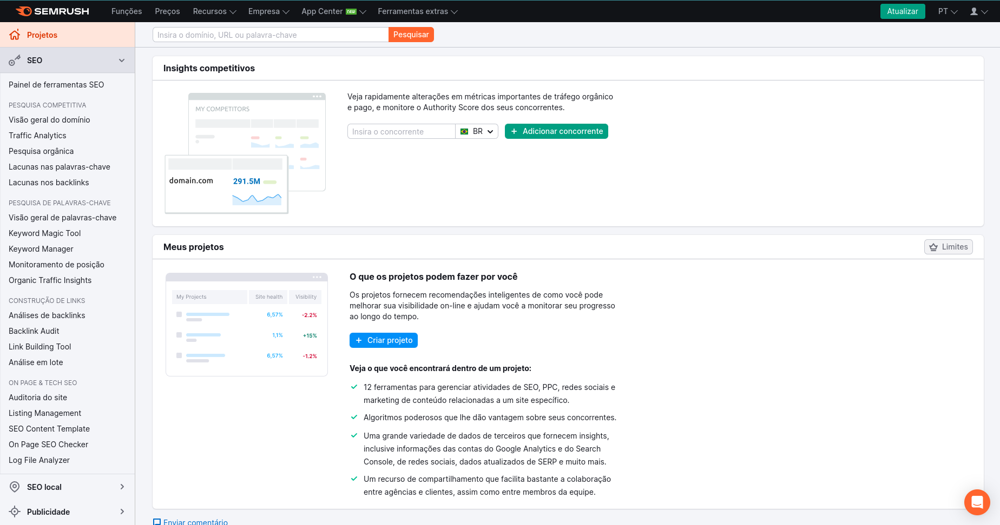
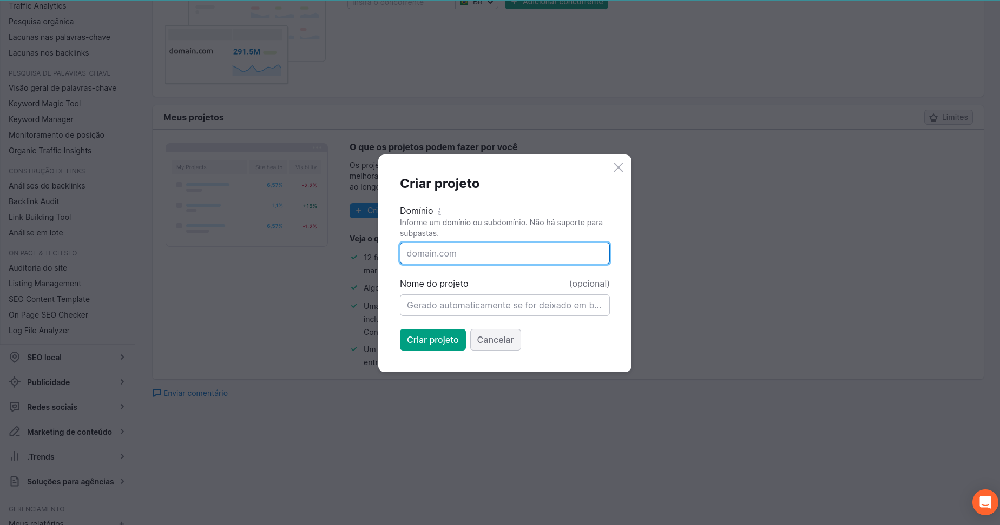

# Criando um projeto no Semrush

Vamos falar sobre todas as funcionalidades dessa ferramenta que podem nos ajudar no dia a dia como Analistas de SEO.

Vamos começar pela criação do projeto hipotético e que, por enquanto, pode não trazer muitos insights além do básico.

## Sobre a criação

Na página inicial, após logarmos, somos apresentados à seguinte tela:

Estamos em `Projetos`, onde temos a listagem dos projetos (sites que coletamos dados e depois os análisamos) que temos criados e configurados.

Ao clicarmos em **Criar Projeto**, será apresentado um pop-up como este:

Aqui informaremos o domínio (se atentando ao fato de que a coleta de dados não é como no GA4, por exemplo, pois a coleta é feita por cada domínio e subdomínio informado, em vez de todos em um único projeot).

Depois, damos um nome ao projeto e, somente então, criamos nosso projeto e podemos iniciar as configurações pertinentes de cada aspecto à ser analisado.

> Quando criamos um projeto no Semrush, a ferramenta passa a computar tudo que fazemos naquele determinado site. É como se tivessemos iniciando um grande repositório de informações sobre o site, mais ou menos como um "Google Drive do SEO" _taggeando_ todas as informações que configuramos ao longo de nossos estudos, nos possibilitando acompanhar nossa performance e progresso no desenvolvimento dos nossos projetos.
