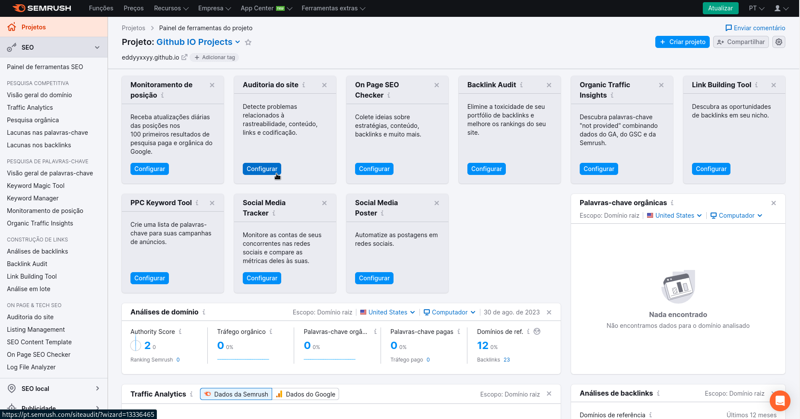
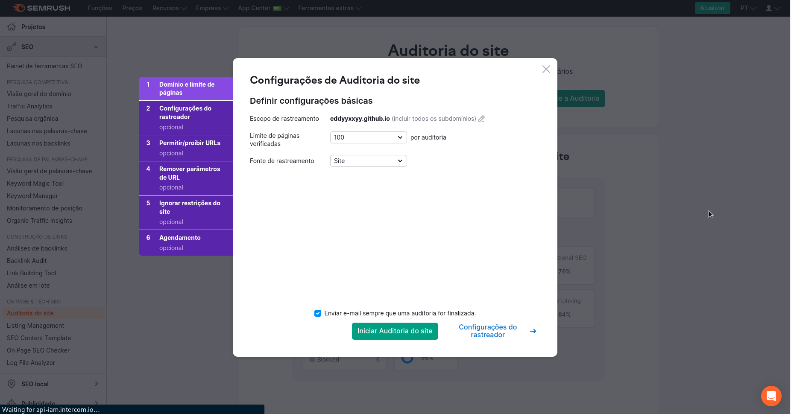

# Auditoria Técnica

Agora que já criamos o nosso projeto, iremos partir para as configurações, que se caracteriza por ser a parte mais importante e valiosa desse processo de criação de projetos no Semrush.

## Configuração de Auditoria do Site

A configuração que me refiro é a da opção **Auditoria do Site**, como apresentada na imagem a seguir:

Ao clicar nessa opção, nos deparamos com um pop-up com diversas configurações, irei ilustrar com somente a primeira tela da configuração, porém a explicação discorrerá sobre cada aspecto:

A depender do plano que temos no Semrush, diversas opções das configurações estarão limitadas. De toda forma, uma boa dica é sempre utilizar a ferramenta alinhada ao conhecimento da arquitetura de seu site e suas páginas.

Por exemplo, ao escolher o limite de páginas verificadas, podemos alinhar a quantidade desse limite com a quantidade real de páginas no momento e no crescimento que pode haver futuramente no site.

Assim não excedemos o **Budget** do nosso plano.

A fonte de rastreamento tem algumas alternativas, mas a mais comum é a opção "Site".

Na aba "Configurações do Rastreador" podemos definir outras especificidades como o User Agent (o crawler que acessa seu site), o delay da exploração feita página a página e se a renderização do JavaScript será ativado ou não. Assim como todas as outras abas (fora a primeira), são opcionais.

> É indicado o uso do GoogleBot Mobile, uma vez que ele irá representar como o maior mecanismo de busca enxerga seu site. Essa prática mitiga um pouco da disparidade de dados entre o Semrush e o GA4.

Após essa aba, temos "Permitir/proibir URLs", que serve para limitar o Semrush assim como o Robots.txt faria.

Em seguida temos mais duas abas que envolvem restringir ou tirar restrições: "Remover parâmetros de URL" e "Ignorar restrições do site", ambas com propósitos parecidos com a de permitir e proibir o acesso de certas URLs.

Ao final, temos a aba "Agendamento", onde podemos definir a frequência de auditoria do nosso site.

Após essas definições já podemos iniciar a auditoria de nosso site.

## E o que fazemos com os dados da auditoria?

Quando colocamos a auditoria para acontecer, é atualizado constantemente (até atingir o limite definido por nós) o número de páginas rastreadas do domínio especificado.

Ao finalizar essa auditoria, a primeira coisa que podemos notar é o Site Health (Saúde do Site, algo que abordaremos mais profundamento no módulo de KPIs) e dispõe de métricas importantes para SEO Técnico, pois cálculam, com base nos problemas que o site possui, qual a saúde do seu site.

Para se ter uma noção, a aba "Problemas" da página de Auditoria elenca os problemas de nosso site por meio de categorias como:

- Todos;
- Erros;
- Advertências e;
- Avisos.

Cada um deles com um grau de urgência, mas que apontam algo que deve ser resolvido. Basicamente se trata da "catalogação" e "apontamento" de todos os problemas On-Page do seu site nas páginas analisadas.

Desses problemas, podemos ter apontados questões sobre Headings, title tags repetidas, JavaScript e CSS não minificados, links internos com diretivas NoFollow, imagens que não possuem alt tags, links externos quebrados, etc.
